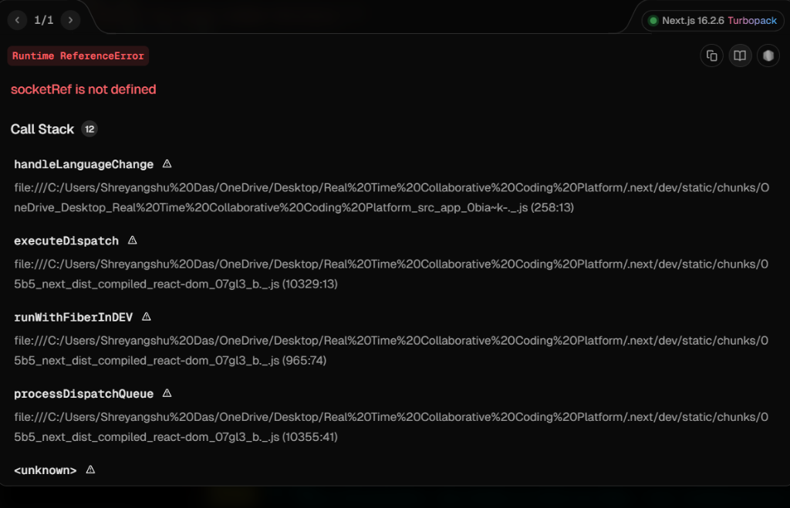

# 🚀 CODTIME
### A Premium Real-Time Collaborative IDE for the Modern Web

[**Explore the App »**](https://codtime.vercel.app)

---

**CODTIME** is a high-fidelity collaborative development environment that bridges the gap between static code editing and full-scale interactive development. Built with a focus on speed, aesthetics, and real-time synchronization.

## 📸 Preview

  

---

## 💎 Features that Define CODTIME

### ⚡ Lightning-Fast Collaboration
Synchronize code across unlimited collaborators with sub-50ms latency. Powered by a custom Socket.io orchestration layer, your team can work together as if they were in the same room.

### 📟 Interactive Pseudo-Terminal (PTY)
A true shell experience in the browser. Unlike simple output logs, our terminal supports:
- **Interactive Prompts**: Full support for `input()` (Python) and `Scanner` (Java).
- **Persistent State**: Run shell commands, navigate directories, and manage processes.
- **Shared Output**: See exactly what your team is executing in real-time.

### ☁️ Universal Cloud Execution
Powered by the **Piston API**, CODTIME supports instant execution for over 10+ major programming languages.
- **Languages**: Python, Java, C++, Rust, Go, JavaScript, TypeScript, Ruby, C#, and more.
- **Zero Configuration**: No local compilers or environments needed.

---

## 🛠️ The Tech Stack

| Layer | Technologies |
| :--- | :--- |
| **Frontend** | Next.js 15, TypeScript, Tailwind CSS, Framer Motion |
| **Backend** | Node.js, Express, Socket.io |
| **Editor** | Monaco Editor (VS Code Engine) |
| **Terminal** | Xterm.js, node-pty |
| **Execution** | Piston API (Global Cloud Engine) |

---

## 🗺️ Learning Journey & Roadmap

CODTIME was developed as a deep dive into real-time engineering. The journey involved overcoming complex challenges in WebSocket state management and server-side process orchestration.

### 🔜 Upcoming Enhancements:
- [ ] **Voice Channels**: Built-in audio for seamless team communication.
- [ ] **Project Folders**: Support for multiple files and directory structures.
- [ ] **Auth Integration**: Secure rooms with Clerk or NextAuth.
- [ ] **Custom Themes**: A gallery of developer-curated editor themes.

---

## 🌐 Quick Deployment Guide

### 1️⃣ Backend (Render/Railway)
- **Root**: `server`
- **Command**: `npm install && node index.js`
- **Env**: `FRONTEND_URL` = Your Vercel URL

### 2️⃣ Frontend (Vercel)
- **Repo**: Link your GitHub
- **Env**: `NEXT_PUBLIC_BACKEND_URL` = Your Backend URL

---

## 📜 License & Acknowledgements
- Distributed under the **MIT License**.
- Special thanks to the **Monaco Editor** and **Xterm.js** communities.

   
  <h3>Developed with 💙 by <b>Shreyangshu Das</b></h3>
  

