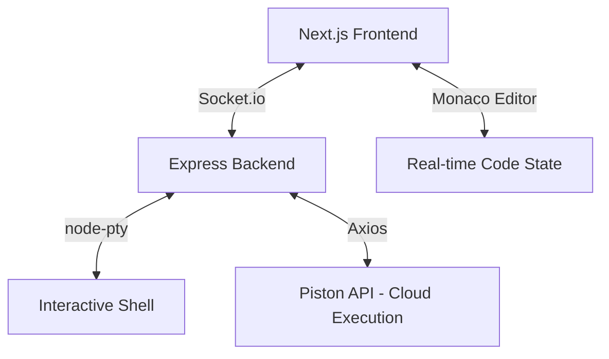

# 🚀 CODTIME: The Ultimate Real-Time Collaborative IDE

[](https://nextjs.org/)
[](https://socket.io/)
[](https://tailwindcss.com/)
[](https://opensource.org/licenses/MIT)

**CODTIME** is a premium, high-fidelity real-time collaborative workspace designed for developers who demand speed, precision, and a high-end aesthetic. Built with the same engine that powers VS Code (Monaco Editor), it provides a seamless "Google Docs for Code" experience.

---

## ✨ Features that "Wow"

### ⚡ Sub-50ms Collaboration
Experience lag-free coding. Using custom Socket.io event orchestration, every keystroke is synchronized across all participants globally in milliseconds.

### 🖥️ Live Interactive Terminal
Unlike basic output logs, CODTIME features a **fully functional Pseudo-Terminal (PTY)**.
- Run interactive shell commands (`ls`, `npm`, `cd`).
- Interact with your running code (supports `input()` in Python, `Scanner` in Java, etc.).
- Shared terminal output for all collaborators.

### 🌍 Cloud Execution Engine
Execute code in **10+ languages** instantly. Powered by the **Piston API**, you don't need local compilers installed. 
- Supported: Python, Java, JavaScript, TypeScript, C++, Rust, Go, Ruby, C#, and more.
- **Java Smart-Sync**: Automatically detects public class names for flawless compilation.

### 🎨 Cyberpunk Glassmorphism UI
A meticulously crafted dark-themed interface featuring:
- Smooth Framer Motion animations.
- Real-time cursor presence and typing indicators.
- Responsive design for tablets and desktops.

---

## 🛠️ Architecture



---

## 🚀 Installation & Local Development

### Prerequisites
- Node.js (v18+)
- NPM or Yarn

### 1. Setup Backend
```bash
cd server
npm install
node index.js
```

### 2. Setup Frontend
```bash
# In the root directory
npm install
npm run dev
```

Visit `http://localhost:3000` to start collaborating!

---

## 🌐 Deployment Guide

### **Phase 1: Backend (e.g., Render / Railway)**
Deploy the `server` directory as a "Web Service".
- **Start Command**: `node index.js`
- **Env Variable**: `FRONTEND_URL` (Set to your Vercel URL)

### **Phase 2: Frontend (Vercel)**
Deploy the root directory.
- **Framework**: Next.js
- **Env Variable**: `NEXT_PUBLIC_BACKEND_URL` (Set to your Render/Railway URL)

---

## 🤝 Contributing
Contributions are what make the open-source community such an amazing place to learn, inspire, and create. Any contributions you make are **greatly appreciated**.

1. Fork the Project
2. Create your Feature Branch (`git checkout -b feature/AmazingFeature`)
3. Commit your Changes (`git commit -m 'Add some AmazingFeature'`)
4. Push to the Branch (`git push origin feature/AmazingFeature`)
5. Open a Pull Request

## 📄 License
Distributed under the MIT License. See `LICENSE` for more information.

---
**Built with 💙 by [Sun1603](https://github.com/Sun1603)**
